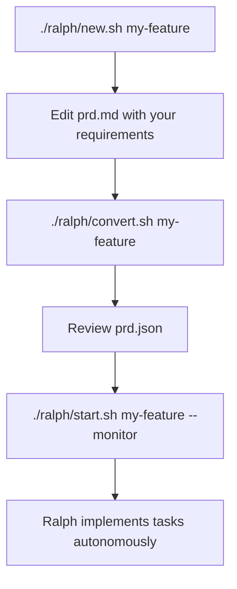
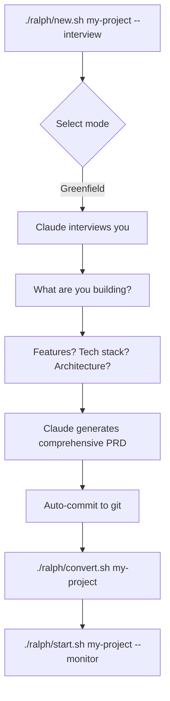
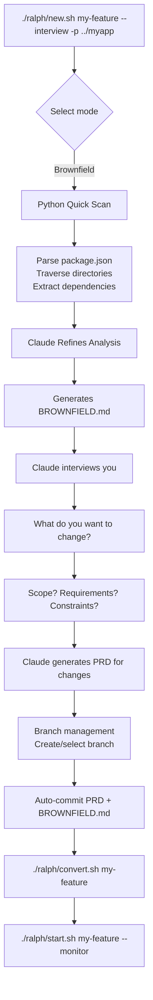

# Ralph - Autonomous AI Development Loop

Ralph is an autonomous development loop system that uses Claude Code to iteratively implement features from a PRD (Product Requirements Document).

## Quick Start

Ralph supports three workflows:

| Workflow | Best For | How to Start |
|----------|----------|--------------|
| **Manual PRD** | You already have a clear PRD | `./ralph/new.sh my-feature` |
| **Greenfield Interview** | Building something new | `./ralph/new.sh my-project --interview` |
| **Brownfield Interview** | Modifying existing codebase | `./ralph/new.sh my-feature --interview -p ../myapp` |

---

## Workflow Diagrams

### Workflow 1: Manual PRD (Traditional)

Use this when you already know exactly what to build.



**Commands:**
```bash
# 1. Create project
./ralph/new.sh my-feature

# 2. Edit PRD manually
code ralph/projects/my-feature/prd.md

# 3. Convert to tasks
./ralph/convert.sh my-feature

# 4. Start loop
./ralph/start.sh my-feature --monitor
```

---

### Workflow 2: Greenfield Interview

Use this when building something new from scratch. Ralph interviews you to gather requirements.



**Commands:**
```bash
# Interactive mode - will prompt for brownfield vs greenfield
./ralph/new.sh my-project --interview

# Or directly specify mode
python3 ralph/interview.py my-project -m greenfield

# With alternative Claude command
RALPH_CLAUDE_CMD="glmclaude" ./ralph/new.sh my-project --interview
```

**Interview Process:**
1. **Project Concept** - What are you building? Who is it for?
2. **Features** - Detailed feature list with acceptance criteria
3. **Tech Stack** - Language, framework, database, key libraries
4. **Architecture** - Project structure, patterns, integrations
5. **Data Models** - Entities and relationships (if applicable)
6. **UI Design** - Pages, navigation, design preferences (if applicable)
7. **Non-Functional** - Performance, security, deployment requirements
8. **Confirmation** - Review and refine

---

### Workflow 3: Brownfield Interview

Use this when modifying an existing codebase. Ralph analyzes the code first, then interviews you about changes.



**Commands:**
```bash
# Auto-detect project root from current directory
./ralph/new.sh my-feature --interview

# Specify exact path
./ralph/new.sh my-feature --interview -p ../myapp

# Or use interview.py directly
python3 ralph/interview.py my-feature -p ../myapp
```

**Interview Process:**
1. **Codebase Analysis** (automatic)
   - Quick scan: dependencies, directory structure, entry points
   - Claude analysis: patterns, conventions, existing features
   - Generates `BROWNFIELD.md`

2. **Change Interview** (interactive)
   - What do you want to change/add?
   - Scope: what NOT to modify?
   - Functional & technical requirements
   - UI/API/data changes (as needed)

3. **Branch Management**
   - Suggests feature branch: `ralph/<project-name>`
   - Can create new branch or use existing
   - Confirms before proceeding

4. **Auto-Commit**
   - Commits `prd.md` and `BROWNFIELD.md` to git

---

## Prerequisites

```bash
# Install dependencies
brew install jq tmux gh  # gh CLI recommended for branch detection
npm install -g @anthropic-ai/claude-code

# Python 3.12+ for interview mode
python3 --version
```

---

## Commands

### `./ralph/new.sh <project-name> [OPTIONS]`

Create a new Ralph project.

```bash
# Manual PRD mode (default)
./ralph/new.sh my-feature

# Interview mode (interactive)
./ralph/new.sh my-project --interview

# Brownfield interview with path
./ralph/new.sh my-feature --interview -p ../myapp

# Alternative Claude command
./ralph/new.sh my-project --interview --claude-cmd "glmclaude"
```

| Option | Description |
|--------|-------------|
| `-i, --interview` | Run interactive interview to generate PRD |
| `-p, --path PATH` | Path to codebase (for brownfield mode) |
| `-c, --claude-cmd CMD` | Claude command to use |
| `-h, --help` | Show help message |

---

### `python3 ralph/interview.py <project-name> [OPTIONS]`

Run interview mode directly (same as `new.sh --interview`).

```bash
# Interactive mode selection
python3 ralph/interview.py myproject

# Force mode
python3 ralph/interview.py myproject -m brownfield
python3 ralph/interview.py myproject -m greenfield

# Specify path and Claude command
python3 ralph/interview.py myfeature -p ../app -c "glmclaude"

# Custom output directory
python3 ralph/interview.py myproject -o ./custom-output
```

| Option | Description |
|--------|-------------|
| `-p, --path PATH` | Path to codebase to analyze (brownfield) |
| `-o, --output-dir PATH` | Custom output directory |
| `-m, --mode MODE` | `brownfield`, `greenfield`, or `auto` (default) |
| `-c, --claude-cmd CMD` | Claude command (or use `RALPH_CLAUDE_CMD` env var) |

---

### `./ralph/convert.sh <project-name>`

Convert PRD.md to actionable JSON tasks using Claude.

```bash
./ralph/convert.sh my-feature
# Reads: ralph/projects/my-feature/prd.md
# Creates: ralph/projects/my-feature/prd.json
# Creates: ralph/projects/my-feature/requirements.md
```

---

### `./ralph/start.sh <project-name> [OPTIONS]`

Run the autonomous development loop.

```bash
# Without tmux (output directly in terminal)
./ralph/start.sh my-feature

# With tmux monitoring (recommended)
./ralph/start.sh my-feature --monitor

# Limit iterations
./ralph/start.sh my-feature -n 10

# Check status
./ralph/start.sh my-feature --status

# Reset circuit breaker
./ralph/start.sh my-feature --reset
```

| Option | Description |
|--------|-------------|
| `-m, --monitor` | Start with tmux session and live monitor |
| `-n, --max-iterations N` | Max loop iterations (default: unlimited) |
| `-c, --calls NUM` | Max calls per hour (default: 100) |
| `-t, --timeout MIN` | Claude timeout in minutes (default: 20) |
| `-s, --status` | Show project status and exit |
| `-r, --reset` | Reset circuit breaker |

---

## Branch Management

Ralph integrates with git for branch management:

### Automatic Branch Handling

When using interview mode with a git repository:

1. **Branch Detection** - Uses `gh` CLI to detect repository info
2. **Branch Prompt** (brownfield):
   - Suggests feature branch: `ralph/<project-name>`
   - Option to create new, use existing, or skip
3. **Confirmation** - Shows current branch + uncommitted changes warning
4. **Auto-Commit** - Commits PRD files with descriptive message

### Branch Selection Options

```
Git Repository Detected
━━━━━━━━━━━━━━━━━━━━━━━━━━━━━━━━━━━━━━━━━━━━━━━━━━━━━━━━━━
  Current branch: main
  Default branch: main
  Available branches: main, feature-1, ralph/previous-work

  Suggested feature branch: ralph/my-new-feature

Options:
  1) Create and use feature branch (Will create: ralph/my-new-feature)
  2) Use current branch (Current: main)
  3) Use existing branch (Select from available branches)
  4) Enter custom branch name
  5) Skip branch management (Proceed without changing branches)

Select option (1-5):
```

### prd.json Branch Configuration

Generated `prd.json` includes the branch name:

```json
{
  "branchName": "ralph/my-new-feature",
  "userStories": [...]
}
```

Ralph's `start.sh` validates the current branch matches `branchName` before starting work.

---

## PRD JSON Format

The `prd.json` file has this structure:

```json
{
  "branchName": "ralph/feature-name",
  "userStories": [
    {
      "id": "1.1",
      "category": "functional",
      "story": "Short description of what to build",
      "steps": [
        "Step 1: What to do",
        "Step 2: Next action",
        "Step 3: How to verify"
      ],
      "acceptance": "Detailed acceptance criteria",
      "priority": 1,
      "passes": false,
      "notes": ""
    }
  ]
}
```

### Fields

| Field | Description |
|-------|-------------|
| `branchName` | Git branch Ralph will create/use for this feature |
| `id` | Story identifier (phase.sequence, e.g., "1.1", "2.3") |
| `category` | One of: `technical`, `functional`, `ui` |
| `story` | One-sentence description of what to build |
| `steps` | Actionable steps to complete the story |
| `acceptance` | Definition of "done" |
| `priority` | **Lower = do first** (1-10 MVP, 11-20 Phase 2, 21+ Phase 3) |
| `passes` | Set to `true` when story is complete |
| `notes` | Ralph fills this with learnings during implementation |

---

## tmux Controls

When running with `--monitor`:

| Keys | Action |
|------|--------|
| `Ctrl+B`, `D` | Detach (keeps running in background) |
| `Ctrl+B`, `←/→` | Switch between panes |
| `Ctrl+B`, `[` | Enter scroll mode (`q` to exit) |
| `tmux ls` | List sessions |
| `tmux attach -t ralph-<project>` | Reattach to session |

---

## Safety Features

- **Rate Limiting**: Max 100 calls/hour (configurable via `--calls` or `MAX_CALLS_PER_HOUR`)
- **Circuit Breaker**: Auto-stops after repeated failures
- **Exit Detection**: Stops when Claude signals completion
- **Branch Isolation**: Each feature runs on its own git branch
- **Branch Validation**: Confirms correct branch before starting work

---

## Learnings System

Ralph has a two-tier learning system:

| File | Purpose | Lifetime |
|------|---------|----------|
| `progress.txt` | Session memory for Ralph | Per-project |
| `AGENTS.md` | Permanent docs for humans & future agents | Forever |

### progress.txt Structure

```markdown
## Codebase Patterns
- Migrations: Use IF NOT EXISTS
- Types: Export from actions.ts

## Key Files
- db/schema.ts
- app/auth/actions.ts

---
## 2024-01-15 - Story 1.1
- What was implemented
- **Learnings:** patterns discovered
```

### AGENTS.md Updates

Ralph updates `AGENTS.md` files in directories where it made changes:

✅ **Good additions:**
- "When modifying X, also update Y"
- "This module uses pattern Z"
- "Tests require dev server running"

❌ **Don't add:**
- Story-specific details
- Temporary notes

---

## Project Structure

```
ralph/
├── new.sh              # Create new project
├── convert.sh          # PRD → JSON converter
├── start.sh            # Main loop
├── monitor.sh          # Status dashboard
├── interview.py        # Interview mode entry point
├── lib/
│   ├── utils.sh        # Common utilities
│   ├── circuit_breaker.sh  # Rate limiting & failure detection
│   ├── response_analyzer.sh  # Parse Claude responses
│   ├── interview_utils.py    # Codebase analysis, git utilities
│   ├── interviewer.py        # Interview orchestration
│   ├── prd_generator.py      # PRD generation from answers
│   └── prompts/
│       ├── brownfield_analysis.md  # Codebase analysis prompt
│       ├── brownfield_interview.md # Brownfield interview prompt
│       ├── greenfield_interview.md # Greenfield interview prompt
│       └── prd_generation.md       # PRD generation prompt
├── templates/
│   ├── PROMPT.md        # Standard prompt
│   ├── prd-template.md  # PRD template
│   └── prd-schema.json  # JSON example
└── projects/
    └── <your-projects>/
        ├── prd.md         # Your PRD (manual or generated)
        ├── prd.json       # Generated tasks
        ├── BROWNFIELD.md  # Codebase analysis (brownfield only)
        ├── requirements.md # Technical specs
        ├── progress.txt   # Progress log
        ├── status.json    # Current status
        ├── PROMPT.md      # Standard prompt
        └── logs/          # Execution logs
```

---

## Generated Files

### BROWNFIELD.md (brownfield mode only)

Comprehensive codebase documentation generated before the interview:

```markdown
# Brownfield Analysis: [Project Name]

## 1. Project Overview
[Inferred purpose from README/code]

## 2. Technology Stack
- **Language:** [Language]
- **Framework:** [Framework + Version]

## 3. Directory Structure
[Tree output with annotations]

## 4. Dependencies
[Key dependencies with versions]

## 5. Existing Features
[Routes, components, modules discovered]

## 6. Architectural Patterns
[State management, routing, data layer patterns]

## 7. Code Conventions
[Naming, imports, organization]

## 8. Testing Patterns
[Test framework, location, mocking]

## 9. Build & Run
[Commands for build, dev, test, lint]
```

### status.json

Current project status:

```json
{
  "project": "my-feature",
  "mode": "brownfield",
  "created_at": "2026-01-14T13:30:00",
  "target_path": "/path/to/codebase",
  "branch": "ralph/my-feature",
  "status": "interview_complete"
}
```

---

## Environment Variables

| Variable | Description | Default |
|----------|-------------|---------|
| `RALPH_CLAUDE_CMD` | Claude command to use | `claude --dangerously-skip-permissions` |
| `MAX_CALLS_PER_HOUR` | Rate limit for start.sh | `100` |
| `CLAUDE_TIMEOUT_MINUTES` | Claude timeout in minutes | `20` |
| `MAX_ITERATIONS` | Max loop iterations | `0` (unlimited) |

---

## Troubleshooting

### Circuit breaker opened
```bash
./ralph/start.sh <project> --status  # Check what happened
./ralph/start.sh <project> --reset   # Reset and continue
```

### Rate limit hit
Ralph automatically waits for the next hour. You can detach with `Ctrl+B, D` and come back later.

### Claude not responding
Check the logs in `ralph/projects/<project>/logs/` for details.

### Interview mode issues
- Verify Python 3.12+ is installed: `python3 --version`
- Check Claude CLI is installed: `claude --version`
- For brownfield: verify target path is correct
- Try with verbose mode to see errors

### Git branch errors
- Install `gh` CLI for best branch detection: `brew install gh`
- Authenticate: `gh auth login`
- Check git status: `git status`
